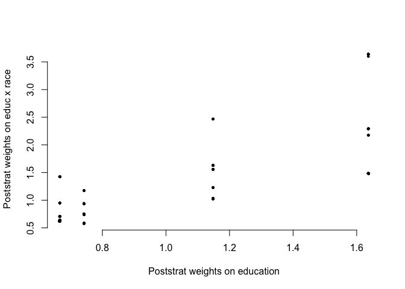
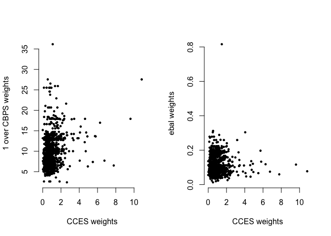

Overview of Modern Survey Weighting
================

<!-- README.md is generated from README.Rmd. Please edit that file -->

*Shiro Kuriwaki* (Stanford University)

*Last presented: July 28, 2021*

(I will be polishing the material, with a recording, in the coming
months. Feedback and inquiries welcome.)

 

> “Survey weighting is a mess.” – Gelman (2007)

 

<!-- badges: start -->
<!-- badges: end -->

Reweighting your data to make it representative of a population of
interest is a ubiquitous operation in data science and survey research.
The procedure has fundamental connections to classical statistical
theory. And recently, the connection between survey inference to causal
inference is resurging: Selection bias has become prominent, semi-opt-in
online surveys are the norm, and traditional methods devised for
researcher-designed sampling have become less relevant. One might refer
to this change in the practice of surveying as the “modern” reality.
However, survey weighting is not taught in standard political science
graduate training. Here I walk through these core concepts taking the
CCES as an example. I draw connections to concepts which are often
covered in political science training, like causal inference or machine
learning. I presume a level of familiarity with a 1st year PhD methods
class covering bias-variance, OLS, and some research design.

------------------------------------------------------------------------

## Setup

Download this repo by
[creating](https://support.rstudio.com/hc/en-us/articles/200526207-Using-Projects)
a **Rstudio Project** of it (From Version Control Repository, Github,
`"https://github.com/kuriwaki/modern-weighting-2021"`).

Start a new R script (or Rmd if you prefer) in the same repository,
root.

Load libraries

``` r
library(tidyverse) # Easily Install and Load the 'Tidyverse'
library(scales) # Scale Functions for Visualization

library(survey) # Analysis of Complex Survey Samples
library(autumn) # Fast, Modern, and Tidy-Friendly Iterative Raking
library(lme4) # Linear Mixed-Effects Models using 'Eigen' and S4
```

Read in data as

``` r
poll <- read_rds("data/poll.rds")
frame <- read_rds("data/pop_microdata.rds")
```

**poll** is a survey of 1,000 people. It is a *biased* sample of the
population, which we call **frame** (the sampling frame) here. Many
times in a survey context we do not have a decent frame available, but
we will use it here

-   `Y` is a binary variable of outcome of interest (e.g. Yes to some
    public opinion question). It is a synthetic variable I made up; the
    content is not important here. It is not observed in the sampling
    frame — the point of a poll is that you only observe the data of
    interest in your sample, but you care about generalizing to the
    population.
-   `S` is an indicator for Selection / Survey Inclusion. It is recorded
    in the frame. It is 1 if the item in the frame ended up in the
    survey, 0 otherwise.
-   `ID` is a common numeric ID for merging.
-   All other variables follow the CCES / Cumulative CCES

*How to read this document.* The preview on github is a compiled version
of README.Rmd. The README.Rmd has the code to produce all the results,
but the preview only shows the results. If you need to check the
answers, you can check the Rmd. Alternatively, you can convert the
solutions as a R script with `knitr::purl("README.Rmd")`.

 

## 1. The Power and Simplicity of Poststratification

> “The purpose of poststratification is to correct for known differences
> between sample and population.” — Gelman (2007)

Q: What is the distribution of education in the sample? In the
population?

    #> # A tibble: 4 x 3
    #>               educ     n frac 
    #>          <dbl+lbl> <int> <chr>
    #> 1 1 [HS or Less]     166 17%  
    #> 2 2 [Some College]   309 31%  
    #> 3 3 [4-Year]         313 31%  
    #> 4 4 [Post-Grad]      212 21%
    #> # A tibble: 4 x 3
    #>               educ     n frac 
    #>          <dbl+lbl> <int> <chr>
    #> 1 1 [HS or Less]    2717 27%  
    #> 2 2 [Some College]  3548 35%  
    #> 3 3 [4-Year]        2323 23%  
    #> 4 4 [Post-Grad]     1412 14%

Q 1.1: What are the weights that correct for this imbalance?

    #> # A tibble: 4 x 3
    #>               educ     n wt_frac
    #>          <dbl+lbl> <dbl>   <dbl>
    #> 1 1 [HS or Less]    272.   0.272
    #> 2 2 [Some College]  355.   0.355
    #> 3 3 [4-Year]        232.   0.232
    #> 4 4 [Post-Grad]     141.   0.141

Q 1.2: What is the weighted proportion of `Y`? Is that closer to the
population proportion of Y than the unweighted proportion?

Q 1.3: Extension: Explain how you would do the same reweighting but for
education and race.

-   What is the distribution of race and education in the population?

<!-- -->

    #>                as_factor(race)
    #> as_factor(educ) White Black Hispanic Asian All Other  Sum
    #>    HS or Less    0.21  0.03     0.02  0.00      0.01 0.27
    #>    Some College  0.25  0.05     0.03  0.01      0.02 0.36
    #>    4-Year        0.16  0.03     0.02  0.01      0.01 0.23
    #>    Post-Grad     0.11  0.01     0.01  0.01      0.01 0.15
    #>    Sum           0.73  0.12     0.08  0.03      0.05 1.01

-   In the survey?

<!-- -->

    #>                as_factor(race)
    #> as_factor(educ) White Black Hispanic Asian All Other  Sum
    #>    HS or Less    0.14  0.01     0.00  0.00      0.00 0.15
    #>    Some College  0.24  0.03     0.02  0.00      0.01 0.30
    #>    4-Year        0.22  0.05     0.03  0.01      0.01 0.32
    #>    Post-Grad     0.17  0.01     0.01  0.01      0.01 0.21
    #>    Sum           0.77  0.10     0.06  0.02      0.03 0.98

Q 1.4: Estimate those weights. How does it differ from the previous
weights?

<!-- -->

Q 1.5: What are some roadblocks / issues with doing poststratification
everywhere?

 

## 2. Raking: an approximation to full poststratification

Q 2.1: Now suppose you did NOT know the population *joint* distribution
of race x education, but you knew the *marginals*. Suppose that

-   White (1): 72%
-   Black (2): 12%
-   Hispanic (3) : 10%
-   Asian (4): 3%
-   Other (5): 3%

and

-   HS or Less (1): 40%
-   Some College (2): 35%
-   4-Year (3): 15%
-   Post-grad (4): 10%

Using raking, create weights that satisfy these marginal distributions.

    #> Joining, by = c("ID", "weight", "weight_cumulative")

<!-- -->

Q 2.2: Intuitively, what is the assumption we need to make for raking to
give the same answer as poststratification?

 

## 3. The Curse of Increased Variance due to Weighting

> “It is not always clear how to use weights in estimating anything more
> complicated than a simple mean or ratios, and standard errors are
> tricky even with simple weighted means.” — Gelman (2007)

Q 3.1 : What is a standard error of a survey estimator? How is it
different from the standard deviation / variance of your estimates?

Q 3.2 : What do you need to compute the MSE (or RMSE) of an estimate?
What are the components?

Q 3.3: Does weighting tend to increase or decrease the standard error of
the estimator? The effective sample size? The design effect? Why?

 

## 4. How is MRP Different?

> “Regression modeling is a potentially attractive alter- native to
> weighting. In practice, however, the poten- tial for large numbers of
> interactions can make regres- sion adjustments highly variable. This
> paper reviews the motivation for hierarchical regression, combined
> with poststratification, as a strategy for correcting for differences
> between sample and population. — Gelman (2007)

Let’s treat the values as factors now

``` r
poll_fct <- poll %>% 
  mutate(educ = as_factor(educ), race = as_factor(race))

frame_fct <- frame %>% 
  mutate(educ = as_factor(educ), race = as_factor(race)) 

tgt_fct <- frame_fct %>% 
  count(educ, race)
```

Q 4.1: Using a logit, what are the predicted values of the outcome in
each of the poststratification cells?

    #> # A tibble: 20 x 4
    #>    educ         race          n      Ypred
    #>    <fct>        <fct>     <int>      <dbl>
    #>  1 HS or Less   White      2137 0.451     
    #>  2 HS or Less   Black       275 0.500     
    #>  3 HS or Less   Hispanic    182 0.400     
    #>  4 HS or Less   Asian        36 0.00000349
    #>  5 HS or Less   All Other    87 0.250     
    #>  6 Some College White      2468 0.375     
    #>  7 Some College Black       538 0.394     
    #>  8 Some College Hispanic    296 0.526     
    #>  9 Some College Asian        74 0.333     
    #> 10 Some College All Other   172 0.286     
    #> 11 4-Year       White      1611 0.391     
    #> 12 4-Year       Black       280 0.438     
    #> 13 4-Year       Hispanic    216 0.621     
    #> 14 4-Year       Asian       122 0.538     
    #> 15 4-Year       All Other    94 0.250     
    #> 16 Post-Grad    White      1071 0.422     
    #> 17 Post-Grad    Black       106 0.533     
    #> 18 Post-Grad    Hispanic     64 0.300     
    #> 19 Post-Grad    Asian       114 0.250     
    #> 20 Post-Grad    All Other    57 0.500

Q 4.2: What is the “MRP” estimate for Y in the population then?

    #> # A tibble: 1 x 1
    #>   Ypred
    #>   <dbl>
    #> 1 0.412

Q 4.3: What are the issues with a simple logit?

 

## 5. Why balancing score are better than inverse propensity weighting

> “Contrary to what is assumed by many theoretical statisticians, survey
> weights are not in general equal to inverse probabilities of selection
> but rather are typically constructed based on a combination of prob-
> ability calculations and nonresponse adjustments.” — Gelman (2007)

Q 5.1: Using the population data and matching on ID, estimate a
propensity score (probability of selection).

-   `S` is a indicator in the frame which indicates the selection /
    survey cases. 1 means the observation is also in `poll`, 0
    otherwise.

<!-- -->

    #> # A tibble: 10 x 4
    #>    ID     race      educ          Spred
    #>    <chr>  <fct>     <fct>         <dbl>
    #>  1 307933 Hispanic  4-Year       0.0956
    #>  2 323528 White     Post-Grad    0.176 
    #>  3 301197 White     Some College 0.0985
    #>  4 291737 White     Some College 0.135 
    #>  5 270162 White     4-Year       0.147 
    #>  6 276240 Black     Some College 0.0851
    #>  7 288696 Hispanic  HS or Less   0.0499
    #>  8 297716 Black     Post-Grad    0.121 
    #>  9 301889 All Other Some College 0.0546
    #> 10 283893 White     Some College 0.0763

Q 5.2: What are the issues in Propensity Score?

Note: Links to Causal Inference and the Weighting vs. Matching
Distinction

-   Coarsened Exact Matching
-   Balance Test Fallacy
-   See Gary’s talk on “Why We Shouldn’t We use Propensity Scores for
    Matching”. Propensity scores can be used for other things other than
    matching (like weighting), but some of the same problems crop up.

Q 5.3: Compute a Covariate Balancing Score Weights from the small frame,
and same with ebal scores

Load packages and start with a small sample.

``` r
library(ebal)
library(CBPS)

select <- dplyr::select # package conflict

# matrix version of what we are about to fit
frame_X <- model.matrix(~ educ + race + state, frame_fct)[, -1]
```

``` r
fit_cbps <- CBPS(S ~ race + educ + state, data = frame_fct, ATT = 0, iterations = 100)
```

``` r
fit_ebal <- ebalance(Treatment = frame_fct$S, X = frame_X)
#> Converged within tolerance
```

<!-- -->

# Takeaways

1.  **Survey inference is causal inference** where the treatment is
    selection
2.  Total Error is **Bias^2 + Variance**
3.  Many things work “in theory” (asymptotically) but cause **variance
    problems** in practice: post-stratification, inverse propensity
    score weighting
4.  **Shrinkage** and regularization (random effects, ML) reduces
    variance at the cost of minimal variance
5.  **Balancing scores** guarantees balance on some marginals, while
    minimizing distance on others.

# Resources for Data

-   Use [`tidycensus`](https://walker-data.com/tidycensus/) to get
    summary stats for the ACS, decennial Census
-   For CCES, I have designed a package
    [`cceMRPprep`](https://www.shirokuriwaki.com/ccesMRPprep/) for
    commonly used functions.
-   Use the `dataverse` package to download Dataverse datasets by code.

# Annotated Bibliography

-   Devin Caughey, Adam Berinsky, Sara Chatfield, Erin Hartman, Eric
    Schickler, and Jas Sekhon.
    [2020](https://doi.org/10.1017/9781108879217). “Target Estimation
    and Adjustment Weighting for Survey Nonresponse and Sampling Bias”.
    *Elements in Quantitative and Computational Methods for the Social
    Sciences*
    -   A good overview, up to date with modern survey sampling, and has
        enough math to clarify what goes on under the hood.
-   Kosuke Imai’s Lecture
    [slides](https://imai.fas.harvard.edu/teaching/files/weighting.pdf)
    on Weighting (PhD level Causal Inference)
    -   Very condensed slide-level overview: IPW, Hajek, CBPS, ebal
-   Andrew Gelman.
    [2007](http://www.stat.columbia.edu/~gelman/research/published/STS226.pdf).
    “Struggles with Survey Weighting and Regression Modeling”,
    *Statistical Science*
    -   The intro is worth reading for general understanding. The main
        text actually turns into a proposal for what is essentially MRP.
-   Douglas Rivers.
    [2007](https://citeseerx.ist.psu.edu/viewdoc/download?doi=10.1.1.468.9645&rep=rep1&type=pdf).
    “Sampling for Web Surveys”
    -   One of the first papers that outlined the new changes for web,
        opt-in surveys.
-   Paul Rosenbaum, Donald Rubin.
    [1983](https://academic.oup.com/biomet/article-pdf/70/1/41/662954/70-1-41.pdf).
    “The central role of the propensity score in observational studies
    for causal effects”. *Biometrika*
    -   One canonical reference for the idea of propensity score
-   Kosuke Imai, Gary King, Elizabeth Stuart.
    [2008](https://imai.fas.harvard.edu/research/files/matchse.pdf).
    “Misunderstandings between experimentalists and observationalists
    about causal inference”, *JRSS A.*
    -   Also see: Gary King.
        [2007](https://www.youtube.com/watch?v=rBv39pK1iEs). “Why
        Propensity Scores Should Not Be Used for Matching”, *Methods
        Colloquium Talk*. (Article with Rich Nielsen).
-   Kosuke Imai, Marc Ratkovic.
    [2014](https://imai.fas.harvard.edu/research/files/CBPS.pdf).
    “Covariate balancing propensity score”, *JRSS B*.
    -   Introduces `CBPS`
-   Jens Hainmueller.
    [2012](https://web.stanford.edu/~jhain/Paper/PA2012.pdf). “Entropy
    Balancing for Causal Effects: A Multivariate Reweighting Method to
    Produce Balanced Samples in Observational Studies”. *Political
    Analysis*
    -   Introduces `ebal`
