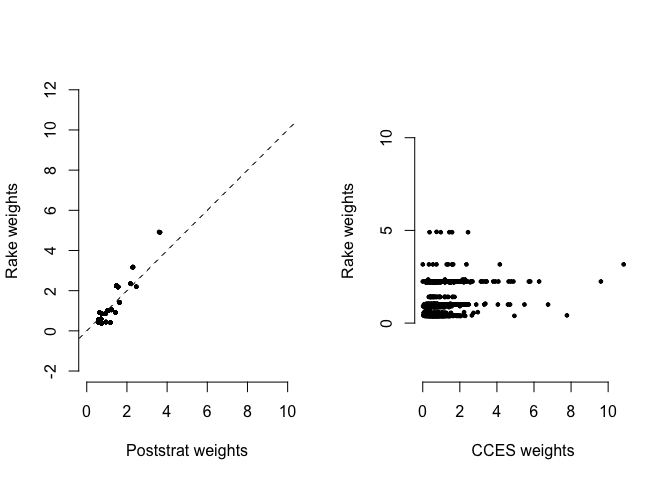

<!-- README.md is generated from README.Rmd. Please edit that file -->

# Modern Weighting 2021

<!-- badges: start -->
<!-- badges: end -->

## Setup

Download this repo as a Rstudio Project (From Remote Repository, Github,
`"kuriwaki/modern-weighting-workshop-2021"`).

Load libraries

``` r
library(tidyverse)
library(scales)
library(autumn)
library(lme4)
```

Read in data as

``` r
poll <- read_rds("data/poll.rds")
pop_micro <- read_rds("data/pop_microdata.rds")
```

# Poststratification

Q: What is the distributon of education in the sample? In the
population?

``` r
poll %>% count(educ) %>% mutate(frac = percent(n / sum(n), accuracy = 1))
#> # A tibble: 4 x 3
#>               educ     n frac 
#>          <dbl+lbl> <int> <chr>
#> 1 1 [HS or Less]     166 17%  
#> 2 2 [Some College]   309 31%  
#> 3 3 [4-Year]         313 31%  
#> 4 4 [Post-Grad]      212 21%
pop_micro %>% count(educ) %>% mutate(frac = percent(n / sum(n), accuracy = 1))
#> # A tibble: 4 x 3
#>               educ     n frac 
#>          <dbl+lbl> <int> <chr>
#> 1 1 [HS or Less]    2717 27%  
#> 2 2 [Some College]  3548 35%  
#> 3 3 [4-Year]        2323 23%  
#> 4 4 [Post-Grad]     1412 14%
```

Q: What are the weights that correct for this imbalance?

``` r
edu_tgt <- pop_micro %>% count(educ) %>% transmute(educ, pop_frac = n / sum(n))

poll_strat <- poll %>% 
  count(educ) %>% 
  mutate(samp_frac = n / sum(n)) %>% 
  left_join(edu_tgt, by = "educ") %>% 
  mutate(weight0 = pop_frac / samp_frac)

poll_wt <- poll %>% 
  left_join(poll_strat, by = "educ")

poll_wt %>% 
  count(educ, wt = weight0) %>% 
  mutate(wt_frac = n / sum(n))
#> # A tibble: 4 x 3
#>               educ     n wt_frac
#>          <dbl+lbl> <dbl>   <dbl>
#> 1 1 [HS or Less]    272.   0.272
#> 2 2 [Some College]  355.   0.355
#> 3 3 [4-Year]        232.   0.232
#> 4 4 [Post-Grad]     141.   0.141
```

Q: Extension: do the same reweighting but for education and race.

``` r
xtabs(~ as_factor(educ) + as_factor(race), pop_micro) %>% 
  addmargins()
#>                as_factor(race)
#> as_factor(educ) White Black Hispanic Asian All Other   Sum
#>    HS or Less    2137   275      182    36        87  2717
#>    Some College  2468   538      296    74       172  3548
#>    4-Year        1611   280      216   122        94  2323
#>    Post-Grad     1071   106       64   114        57  1412
#>    Sum           7287  1199      758   346       410 10000
```

# Raking

Q: What is the distribution of race and education in the survey.

Now suppose you did NOT know the population *joint* distribution of race
x education, but you knew the *marginals*. Suppose that

-   White: 70%
-   Black: 12%
-   Hispanic: 8%
-   Asian: 4%
-   Other 6%

and

-   HS or Less (1): 40%
-   Some College (2): 35%
-   4-Year (3): 15%
-   Post-grad (4): 10%

``` r
target_rake <- list(
  race = c(`1` = 0.70, `2` = 0.12, `3` = 0.08, `4` = 0.04, `5` = 0.06),
  educ = c(`1` = 0.40, `2` = 0.35, `3` = 0.15, `4` = 0.10)
)

poll_rake <- harvest(poll,  target_rake, weight_column = "rake_weight")
```

<!-- -->

Q: What are some issues with doing poststratiifcation everywhere?

# Increased Variance Due to Weighting / Design Effect

Mean Square Error formula

Kish’s design effect

# MRP

Many cells problem

``` r
fit_glmer <- glmer(Y ~ (1 | educ), family = binomial, poll)
```

Shrinkage

# Propensity Score (IPW) vs. Balancing Score

Links to Causal Inference

Coarsened Exact Matching

Balance Test Fallacy

Entropy Balancing / CBPS
